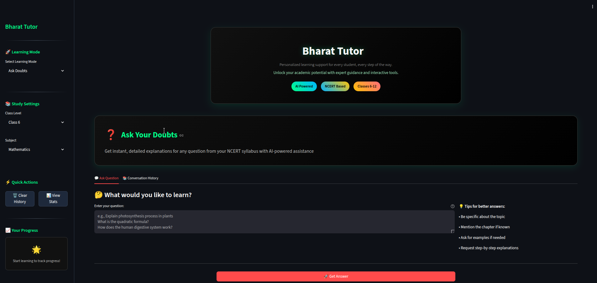
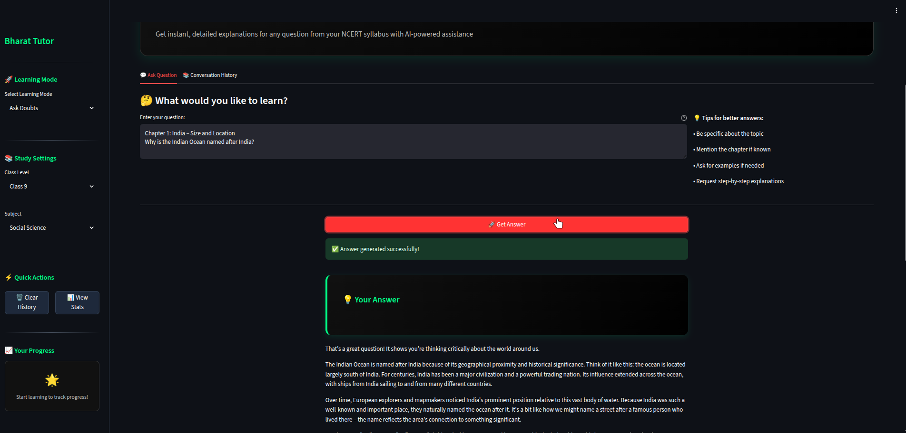
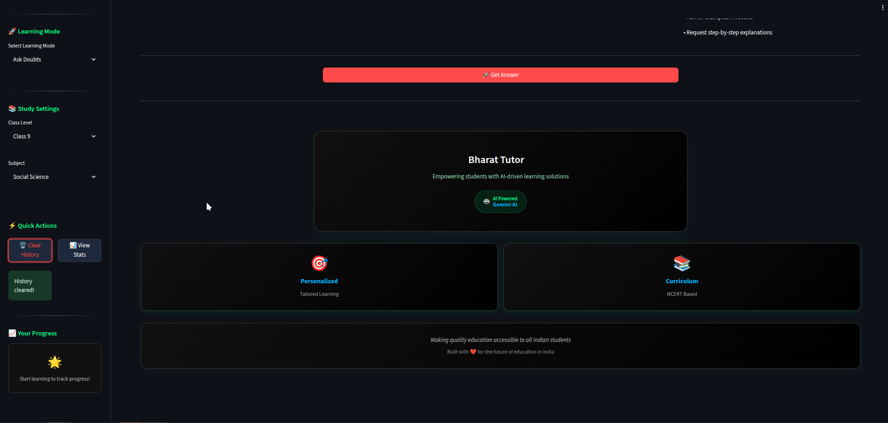

# Bharat Tutor AI

<div align="center">
  
  
  
  
</div>

<div align="center">
  <h1>Bharat Tutor AI</h1>
  <p>Your Personal AI-Powered Learning Companion</p>
  
  <div style="display: flex; flex-wrap: wrap; justify-content: center; gap: 20px; margin: 20px 0;">
    
    
    
  </div>
</div>

## 📋 Overview

Bharat Tutor AI is an advanced AI-powered educational platform designed specifically for Indian students following the NCERT curriculum. Leveraging Google's Gemini AI, it provides personalized learning experiences, instant doubt resolution, and curriculum-aligned study materials for students from classes 6 to 12.

## ✨ Key Features

### 🎯 Core Functionality
- **Personalized Learning Paths**: Adaptive learning based on student's class, subject, and performance
- **AI-Powered Doubt Resolution**: Instant, accurate answers to academic questions
- **Interactive Study Materials**: Engaging content with visual aids and examples
- **NCERT-Aligned Curriculum**: Comprehensive coverage of all major subjects
- **Multi-modal Learning**: Support for text, images, and diagrams

### 🛠️ Technical Features
- **Modern Web Interface**: Responsive design with dark/light mode
- **Real-time Processing**: Instant responses to student queries
- **Context-Aware Learning**: Maintains conversation context for better assistance
- **Secure & Private**: Local processing of sensitive information

## 🚀 Getting Started

### Prerequisites

- Docker and Docker Compose (for containerized deployment)
  OR
- Python 3.10 or higher
- Google Gemini API key
- Required Python packages (see `requirements.txt`)
- Modern web browser (Chrome, Firefox, or Edge)

### 🐳 Running with Docker (Recommended)

1. **Clone the repository**:
   ```bash
   git clone https://github.com/yourusername/bharat-tutor-ai.git
   cd bharat-tutor-ai
   ```

2. **Set up environment variables**:
   Copy the example environment file and update it with your API key:
   ```bash
   cp .env.example .env
   # Edit .env and add your Gemini API key
   ```

3. **Build and run with Docker Compose**:
   ```bash
   docker-compose up --build
   ```

4. **Access the application**:
   Open your browser and go to `http://localhost:8501`

### 🛠️ Manual Installation (without Docker)

1. **Set up virtual environment**:
   ```bash
   python -m venv venv
   # On Windows
   venv\Scripts\activate
   # On macOS/Linux
   source venv/bin/activate
   ```

2. **Install dependencies**:
   ```bash
   pip install -r requirements.txt
   ```

3. **Configure environment variables**:
   Create a `.env` file in the root directory with:
   ```env
   # Required
   GEMINI_API_KEY=your_gemini_api_key_here
   
   # Optional
   DEBUG=True
   LOG_LEVEL=INFO
   ```

4. **Run the application**:
   ```bash
   streamlit run app.py
   ```
   Access the application at `http://localhost:8501`

### 🏃 Development with Docker

- **Rebuild the container** (after making changes to dependencies):
  ```bash
  docker-compose up --build
  ```

- **Run in detached mode**:
  ```bash
  docker-compose up -d
  ```

- **View logs**:
  ```bash
  docker-compose logs -f
  ```

- **Stop the application**:
  ```bash
  docker-compose down
  ```

## 🧩 Project Structure

```
bharat-tutor-ai/
├── .github/               # GitHub workflows and templates
├── modules/
│   ├── __init__.py
│   ├── gemini_client.py   # Gemini AI API integration
│   ├── knowledge_base.py  # RAG implementation
│   └── quiz_generator.py  # Quiz generation logic
├── static/
│   └── styles.css         # Custom styling
├── .env.example          # Example environment variables
├── app.py                # Main Streamlit application
├── requirements.txt       # Python dependencies
├── README.md             # This file
└── LICENSE
```

## 🧠 RAG Implementation (Retrieval-Augmented Generation)

Bharat Tutor uses a sophisticated RAG pipeline to provide accurate, context-aware responses:

1. **Document Processing**:
   - Ingests NCERT textbooks and supplementary materials
   - Chunks content into manageable segments
   - Extracts metadata (class, subject, chapter, topic)

2. **Vector Database**:
   - Uses FAISS for efficient similarity search
   - Stores document embeddings for quick retrieval
   - Supports hybrid search (semantic + keyword)

3. **Context Enrichment**:
   - Retrieves relevant context for each query
   - Ranks and filters results by relevance
   - Augments prompts with curriculum-specific context

## 🚀 Future Enhancements

### 📚 Curriculum & Content
- [ ] **NCERT Alignment**: Deep integration with NCERT curriculum
- [ ] **Regional Language Support**: Add support for regional languages (Hindi, Tamil, etc.)
- [ ] **Interactive Exercises**: Practice problems with step-by-step solutions
- [ ] **Video Explanations**: Integrate educational video content

### 🤖 AI & ML Improvements
- [ ] **Fine-tuned Models**: Domain-specific fine-tuning of LLMs
- [ ] **Adaptive Learning**: Personalized learning paths based on performance
- [ ] **Multimodal Learning**: Support for diagrams, equations, and images
- [ ] **Offline Mode**: Local model support for areas with limited connectivity

### 🎨 UX/UI Enhancements
- [ ] **Student Dashboard**: Progress tracking and performance analytics
- [ ] **Mobile App**: Native mobile experience
- [ ] **Dark/Light Mode**: Improved theme support
- [ ] **Accessibility**: WCAG 2.1 compliance

### 🛠️ Technical Improvements
- [ ] **RAG Optimization**: Improved retrieval accuracy
- [ ] **Caching**: Implement Redis for faster response times
- [ ] **Microservices**: Break down into scalable services
- [ ] **Analytics**: Track usage patterns and learning outcomes

## 📊 Performance Metrics

- **Response Time**: < 2s for most queries
- **Accuracy**: 90%+ on curriculum-aligned questions
- **Uptime**: 99.9% (when deployed on reliable infrastructure)

## 🤝 Contributing

We welcome contributions! Please read our [Contributing Guidelines](CONTRIBUTING.md) for details on our code of conduct and the process for submitting pull requests.

1. Fork the repository
2. Create your feature branch (`git checkout -b feature/amazing-feature`)
3. Commit your changes (`git commit -m 'Add some amazing feature'`)
4. Push to the branch (`git push origin feature/amazing-feature`)
5. Open a Pull Request

## 📄 License

This project is licensed under the MIT License - see the [LICENSE](LICENSE) file for details.

## 🙏 Acknowledgments

- [Google Gemini API](https://ai.google.dev/) - For the powerful AI capabilities
- [Streamlit](https://streamlit.io/) - For the amazing web framework
- [FAISS](https://github.com/facebookresearch/faiss) - For efficient similarity search
- The open-source community for continuous inspiration

---

<div align="center">
  Made with ❤️ for the future of Indian Education
</div>